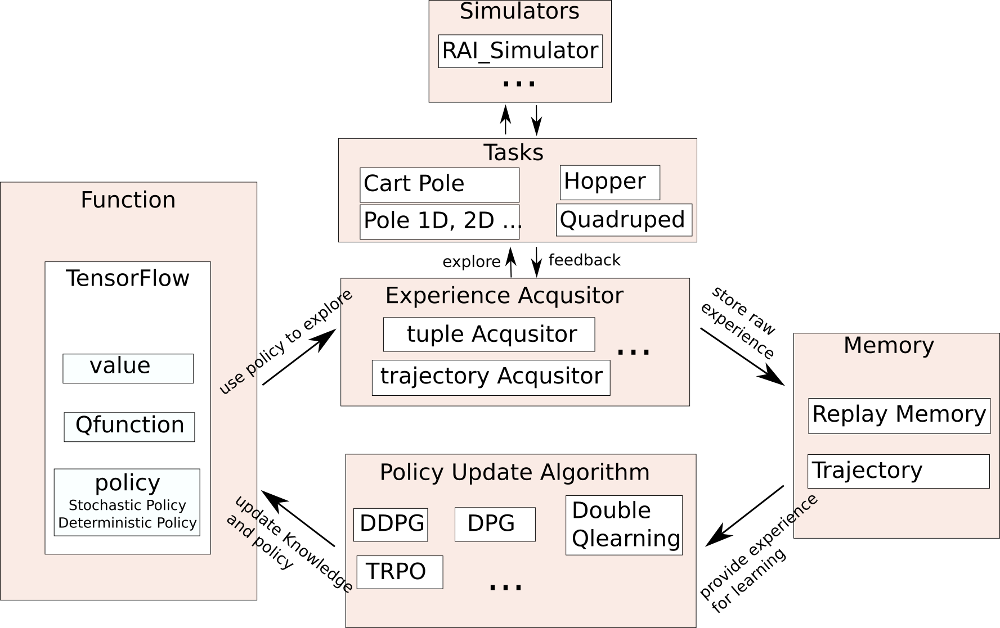

========================
Core
========================

The core of RAI is simply a collection of classes needed for learning. They are grouped into the following 6 categories

* function
* algorithm
* memory
* experience acquisitor
* noise
* task

The algorithm class is constructed with pointers of classes of other five categories.
The elements in the core modules are interacting with each other with the following manner.

Note that we separated an experience acquisition method from an algorithm since most algorithms explore similarly.
In addition, this reduces a burden for algorithm developers since writing a parallel data acquisition method is not very simple.

Here we only explain about tensorflow part of the function module since the rest is simple and trivial to use.

Tensorflow
========================

Tensorflow module is written in python as well since the current c++ api of Tensorflow is not complete yet.
There are two types of classes that your are interested in, SpecializedFunction and GraphStructure.
GraphStructure is just a particular form of a graph (e.g. CNN and MLP). It has a designated number of inputs and outputs.
SpecializedFunction (e.g. Qfunction, Policy and ValueFunction) wraps GraphStructure and becomes a complete function.
For example, if ValueFunction wraps MLP then we have a ValueFunction in a form of MLP.
To construct such function in your app file you call::

    ValueFunction_Tensorflow("cpu", "MLP", "tanh 1e-3 2 32 32 1", 0.001);

The arguments are computation mode, GraphStructure, params for GraphStructure and the learning rate, respectively.
If you want to create a new GraphStructure or a new SpecializedFunction, please refer to Q&A section.

rai::Tensor
========================

rai::Tensor is the main data format of RAI. It provides convenient interfaces with :code:`Eigen::Tensor`, :code:`Eigen::Matrix`, and :code:`tensorflow::Tensor`.
It's underlying data storage format is :code:`tensorflow::Tensor` and provides :code:`Eigen::Map` to both :code:`Eigen::Tensor` and :code:`Eigen::Matrix`.
It follows column-major format. So it has the same index as :code:`Eigen` objects but a reverse index of a :code:`tensorflow::Tensor` object.
A simple example code is below::

    #include "rai/RAI_Tensor.hpp"

    int main() {

      rai::Tensor<float, 2> ten({3,2}, "test tensor");
      Eigen::Matrix<float, 3, 2> eMat;
      Eigen::Tensor<float, 2> eigenTen(3,2);
      tensorflow::Tensor tfTensor(tensorflow::DataType::DT_FLOAT, tensorflow::TensorShape({2,3}));

      eMat.setConstant(1);
      eigenTen.setConstant(2);
      tfTensor.tensor<float,2>().setConstant(3);

      /// testing '=' operator
      ten.setZero();
      std::cout<<"my tensor (should be 0) "<<std::endl<<ten<<std::endl;
      ten = eMat;
      std::cout<<"my tensor (should be 1)"<<std::endl<<ten<<std::endl;
      ten = eigenTen;
      std::cout<<"my tensor (should be 2)"<<std::endl<<ten<<std::endl;
      ten = tfTensor;
      std::cout<<"my tensor (should be 3)"<<std::endl<<ten<<std::endl;

      /// checking 2d Eigen Matrix operation test
      Eigen::Vector3f eigenVec(7,7,7);
      Eigen::RowVector2f eigenVec2(4,4);
      ten.col(0) = eigenVec;
      ten.row(2) = eigenVec2;
      std::cout<<"my tensor (first column should be 7, 3rd row is 4)"<<std::endl<<ten<<std::endl;

      /// checking 3d methods
      rai::Tensor<float, 3> ten3D({3, 2, 4}, "testTensor");
      ten3D.setConstant(1.5);
      ten3D.batch(2) = eMat;
      std::cout<<"3rd batch of tensor should be 1"<<std::endl<<ten3D<<std::endl;

      ten3D.partiallyFillBatch(1, eigenVec);
      std::cout<<"1st column fo the 2rd batch of tensor should be 7"<<std::endl<<ten3D<<std::endl;

      ten3D.resize({3,2,2});
      std::cout<<"there should be 12 numbers now"<<std::endl<<ten3D<<std::endl;
    }

:code:`rai::Tensor` can be casted to :code:`std::pair<std::string, tensorflow::Tensor>`.
So you can directly use it with :code:`tensorflow::Session::Run()` function.