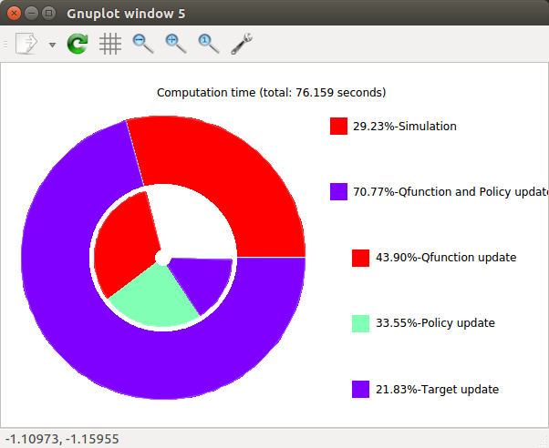
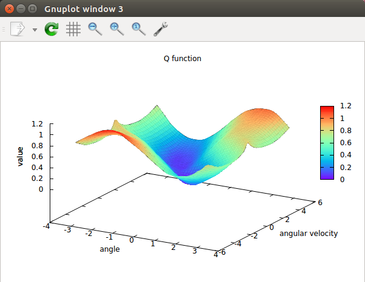

========================
Non-Core Modules
========================

Non-core modules are still very useful tools that you must understand.

Utils
========================

All RAI_Utils are global shared pointers which can be included by simply including <rai/RAI_core>.
There are three utils available at the moment and their pointer names are :code:`RAI::Utils::graph`, :code:`RAI::Utils::logger` and :code:`RAI::Utils::timer`.
When :code:`RAI_Init()` is called in your app file, all data (i.e. logging data, timer log, graphs and network protobuf files) are saved in :code:`logsNplots/<current date>`.

logger
^^^^^^^^^

There are two methods that you have to call to use RAI_Logger. :code:`logger→addVariableToLog()` and :code:`logger→appendData()`. Here is an usage example::

    Utils::logger->addVariableToLog(2, "Nominal performance", "");
    logger->appendData("Nominal performance", float(acquisitor_->stepsTaken()), float(averageCost));

Here 2 represents the dimension of the data you want to log and the “Nominal performance” is the name of the variable. The appendData method uses a variardic template so you can append data as many as the dimension of the variable. It takes scalar input, data pointer or both.

timer
^^^^^^^^^

RAI_Timer tracks the allocation of the computational resources. One of the notable features of RAI_Timer is that it keeps track of the hierarchy of the computation loops. For example::

    #include <rai/RAI_core>
    Int main(){
      RAI::Utils::timer->startTimer(“V func learning”);
      DoSomething();
      RAI::Utils::timer->startTimer(“backProp”);
      DoBackProp();
      RAI::Utils::timer->stopTimer(“backProp”);
      RAI::Utils::timer->stopTimer(“V func learning”);
    }

Here “backProp” is nested inside the “V func learning”. RAI_Timer keeps track of the hierarchy of the timer loops and generates a figure that looks like

It is important that the hierarchy is always consistent. For example, if “backProp” loop is introduced outside of “V func learning” in the later part of the code, the RAI_Graph will fail to produce a meaning pie chart.

**You must not use timer in multi-treaded part of the code**. This means no timer in :code:`ExperienceAcquisitor`, :code:`Task` and :code:`Noise`.
If you do not want to log the computation costs of the certain parts of the code, simply use::

    timer->disable();
    DoSomething();
    timer->enable();

graph
^^^^^^^^^

RAI_Graph is a wrapper for Gnuplot. Its syntax is very similar to that of MATLAB. It offers a various 2D plotting methods (e.g. dotted and various types of lines, lines&points, points, 2D arrows and dots) and also 3D methods (e.g. heat map, 3D point plots, 3D surface plotting and 3D arrows).
All figure creating starts with :code:`graph->figure()` or :code:`graph->figure3D()` method except for heatMap creation which starts with :code:`graph->drawHeatMap()`.
At the moment when the :code:`drawFigure` method is called, the graph is generated. Here is an example::

    ////////////////////// Plotting properties ////////////////////////
    RAI::Utils::Graph::FigProp2D prop1;
    prop1.title = "Number of Steps Taken vs Performance";
    prop1.xlabel = "N. Steps Taken";
    prop1.ylabel = "Performance";

    RAI::Utils::Graph::FigProp3D prop2;
    prop2.title = "Q function";
    prop2.xlabel = "angle";
    prop2.ylabel = "angular velocity";
    prop2.zlabel = "value";
    prop2.displayType = RAI::Utils::Graph::DisplayType3D::heatMap3D;

    /// plotting with rai_logger
    graph->figure(1, prop1);
    graph->appendData(1,logger->getData("Nominal performance", 0),
                        logger->getData("Nominal performance", 1),
                        logger->getDataSize("Nominal performance"),
                        RAI::Utils::Graph::PlotMethods2D::linespoints,
                        "performance",
                        "lw 2 lc 4 pi 1 pt 5 ps 1");
    graph->drawFigure(1);

    /// plotting with custom array
    graph->drawHeatMap(3, prop2, x.data(), y.data(), z.data(), 51, 51, "");
    graph->drawFigure(3);

Note that every figure has figure numbers. Here we used figure 1 and 3. RAI_Graph can plot 6 graphs at a time so only 0~5 are allowed as figure numbers. Depending on the figure number, their corresponding windows will be generated at the predefined positions.

A typical RAI_Graph figure looks like

RAI_Graph only supports maximum 6 figures per process.

Graphics
========================
RAI_Graphics is based on OpenGL, SDL and GLSL.
It is efficient in displaying large meshes since all meshes are saved in the GPU memory and the GLSL shader does all the processing (transformation and shading) in GPU.
It also offers very simple interface and automatic video recording.
Be careful when recording video since saving many frames might take too much disk space.

Here is a simple example::

    #include "RAI_graphics.hpp"
    #include "obj/Mesh.hpp"

    int main() {

      RAI_graphics graphics(800, 600);

      Obj::Mesh anymalBase(<FILE PATH>, 0.001); // 0.001 is a rescale factor
      Obj::Background background(<FILE NAME>);

      graphics.addObject(&anymalBase);
      graphics.addBackground(&background);

      graphics.start(); //this opens up the window
      usleep(5e6);
      graphics.end(); // this terminates the cleans up the memory

      return 0;
    }

This code shows ANYmal base and the sky background for 5 seconds and terminates.
You can control the camera using “w,a,s,d” keys and mouse if you are in free-cam-mode.
For follow-mode, the camera is attached to an object that you specify.
The mode can be switched by the “space bar”. Normal objects have method setPose(), setPos() and setOri() that you can use to move them around.
Super objects, such as ANYmal and Checker board, have their own unique method to control their motion.
To select which body to follow, you can do the following::

    RAI_graphics::CameraProp cprop;
    Eigen::Vector3d relPos; relPos << 3, 0, 0.1;
    cprop.toFollow = &anymalBase;
    cprop.relativeDist = relPos;
    graphics.setCameraProp(cprop);

To save the display as a video, do::

    graphics.savingSnapshots(<FILE PATH>, <FILE NAME>);
    usleep(5e6);
    graphics.images2Video();

If your task uses RAI_Graphics as a visualizer, you can save videos while running your task. RAI saves videos if the following three conditions are met,
1. display is running (after :code:`graphics.start()` and before :code:`graphics.end()`).
2. task visualization is on. This is set by the algorithm. You can control your algorithm's visualization by :code:`algorith.setVisualizationLevel()` method.
3. task is enabled for recording. This is set by :code:`task.enableVideoRecording()` and unset by :code:`task.disableRecording()`. The latter method triggers saving the video to the path defined by your algorithm.